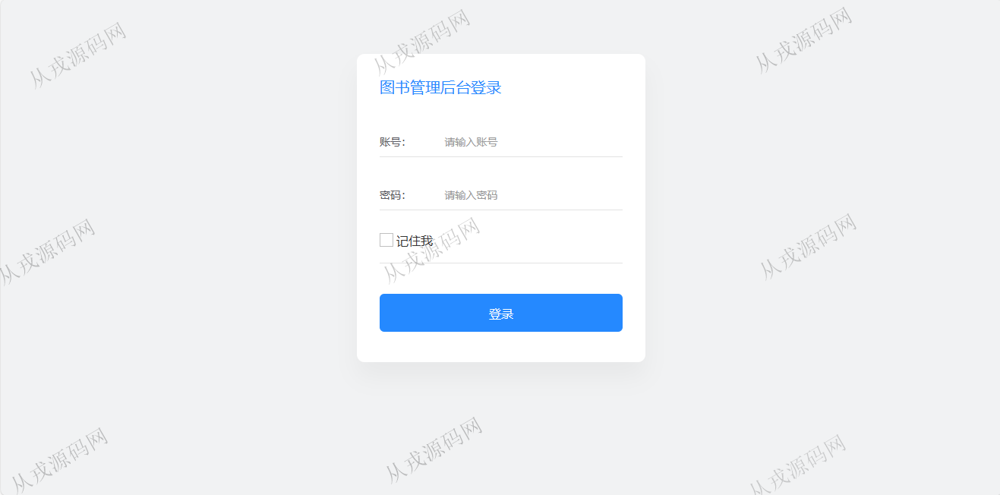
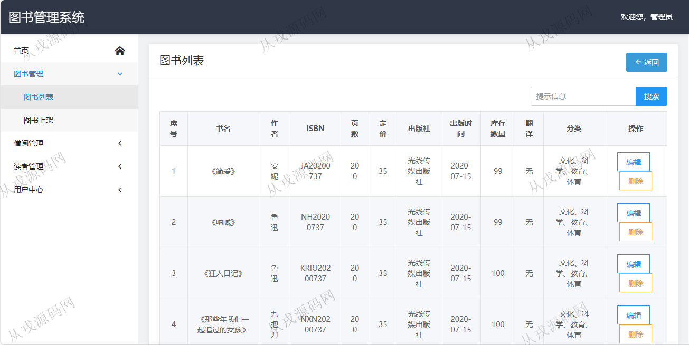
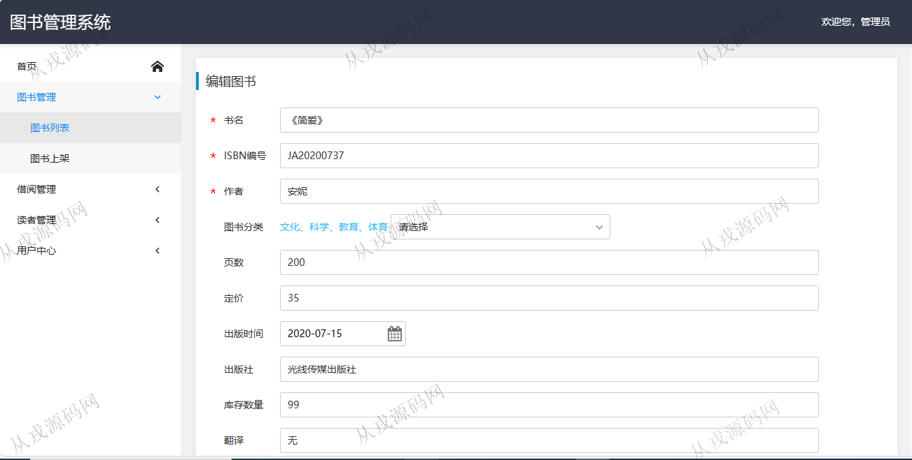
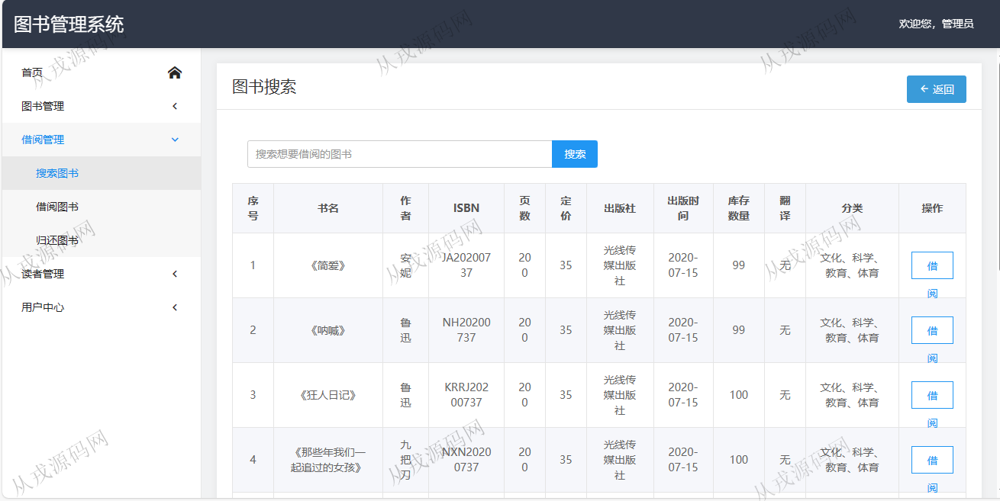
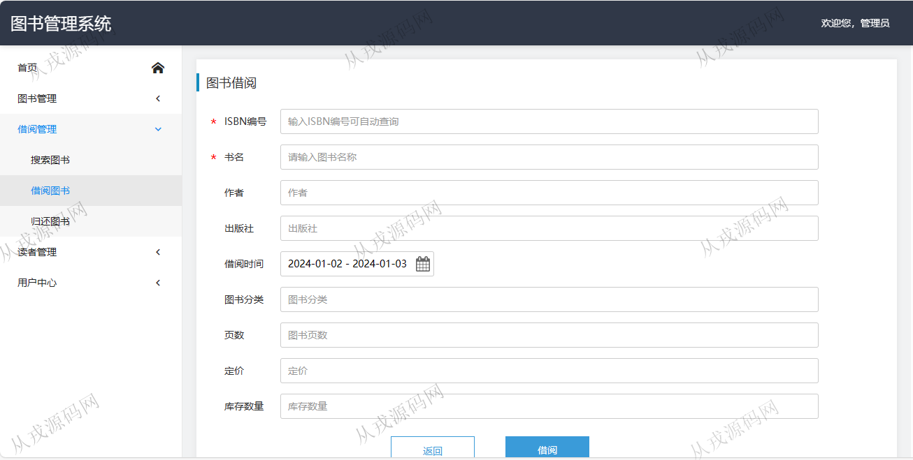
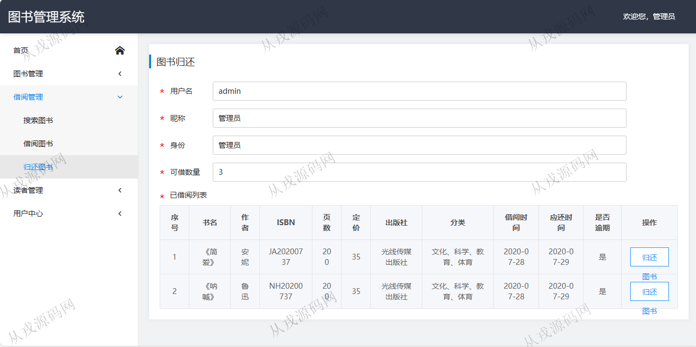
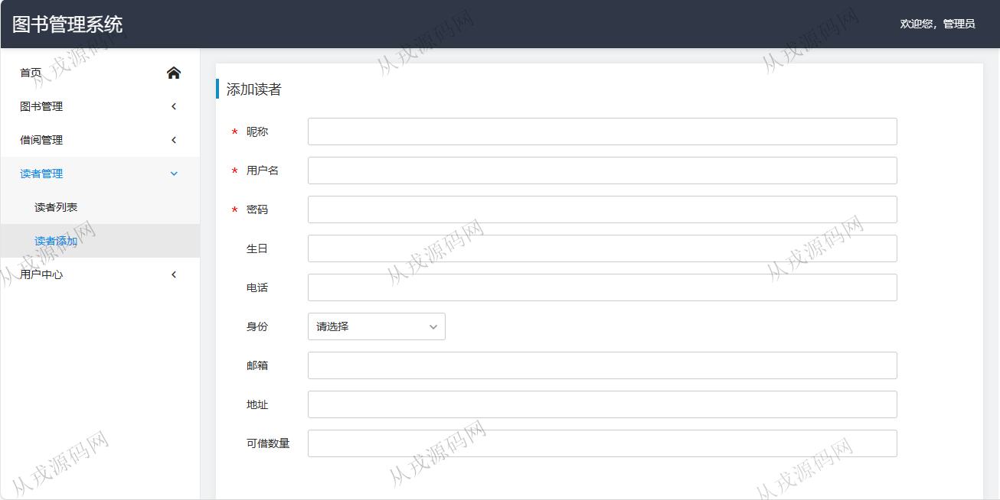

<h1 align="center">96.图书后台管理系统</h1>

 获取sql文件 QQ: 386869957 QQ群: 377586148 

 [推荐站点: 从戎源码网](https://armycodes.com/) 

## 简介

> 本代码来源于网络,仅供学习参考使用!
>
> 提供1.远程部署/2.修改代码/3.设计文档指导/4.框架代码讲解等服务
> 
> 登录地址：http://localhost:8080/login
> 
> 管理员 admin 123
> 
> 读者 stu 123
>

## 项目介绍
基于springboot的图书后台管理系统：前端 Thymeleaf、js，后端 maven、spring、security、mybatis，角色分为管理员、读者；集成图书管理、借阅管理、读者管理等功能于一体的系统。

## 功能介绍

- 图书管理：图书信息的增删改查，图书上架
- 借阅管理：搜索图书，图书列表查询，借阅，图书归还
- 读者管理：读者信息的增删改查，关键词搜索查询
- 用户中心：个人信息查询和修改，用户信息的提权和删除，用户信息搜索

## 环境

- <b>IntelliJ IDEA 2021.3</b>

- <b>Mysql 5.7.26</b>

- <b>JDK 1.8</b>

## 运行截图

